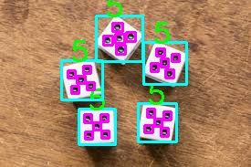
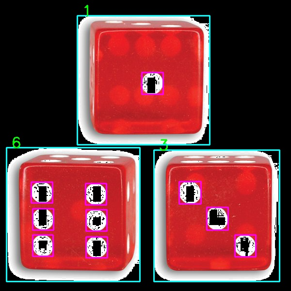
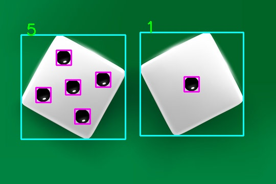

# ASSIGNMENT 8

## Installation
Run this command in terminal.
```
pip install -r requirements.txt
```

## Usage
### dice_numbers.py
By running this code, you can read the number of dice present in the image as well as the numbers on each dice.






### hist2image.py
By running this file, you can generate a random image from a histogram.


### find_contours.py
By running this file and providing an image, you can obtain its contours.

### contour_area.py
Calculate area of a contour.

### bounding_rect
By providing the information of a contour to this file, the bounding rectangle around it will be calculated and returned.

### webcam_application
Add your face on an image

